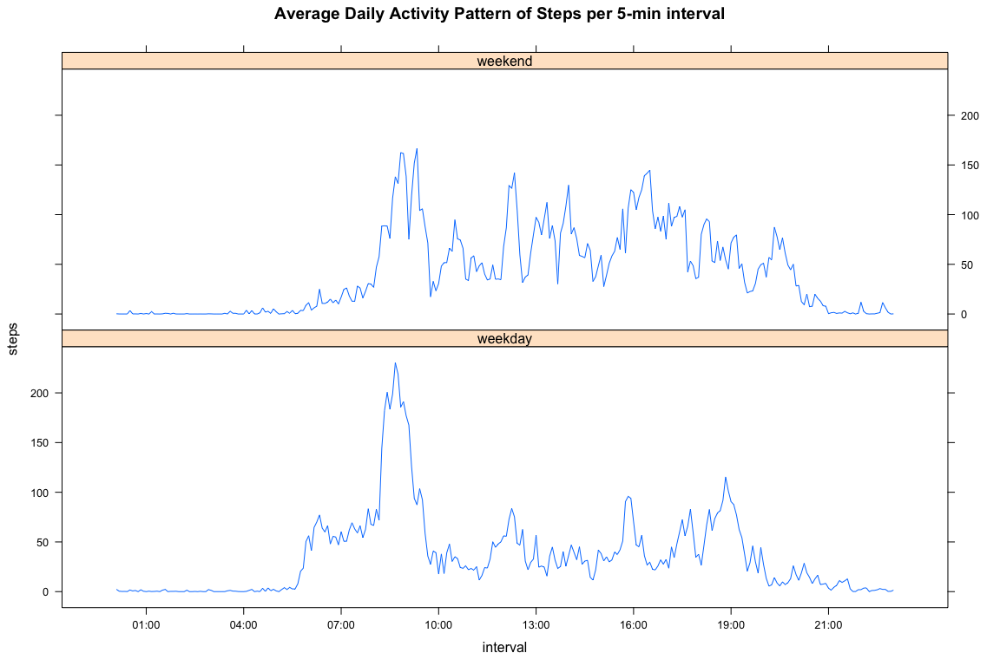

# Reproducible Research: Peer Assessment 1
Edwin Seah  
04 March 2015  


## Loading and preprocessing the data  

1. Load the data (i.e. `read.csv()`)

+ We unzip the raw zip file containing activity data into a specified data 
directory within our working directory, and load it using `read.csv()` into
a data frame called **df**. Integer is also specified as the type for *interval*
to simplify transforming.  


```r
unzip("activity.zip", exdir="data")
df <- read.csv("data/activity.csv", 
               header=TRUE, 
               colClasses=c("integer", "Date", "integer")
               )
```
  
2. Process/transform the data (if necessary) into a format suitable for your analysis  

+ We will use transform *date* and *interval* to form a new *hhmm* column in
order to plot the data accurately. Instead of converting the interval to a POSIXlt
object (which force-inserts an arbritary Date) we'll use a sequential integer 
called *intervalID* that we attach to every interval using `cbind()` with 
replacement, knowing that there are always 288 5-min intervals per day. Checks on
the original dataset dimensions reveal they are roundly divisible by 288 as well, 
showing there are indeed 61 unique days in the data set.  


```r
df$hhmm=sprintf("%04d", df$interval)
df <- cbind(df, seq(unique(df$interval)))
names(df) <- c("steps", "date", "interval", "hhmm", "intervalID")
```

## What is mean total number of steps taken per day?  

1. Make a histogram of the total number of steps taken each day

+ We make the histogram using a new data frame that will exclude the NA values. 
To create this new data frame (called **mts**), we use the **dplyr** package to
transform the raw data frame **df**:

    + Remove *interval*, *steps*, and *datetime* columns (we do not need them)
    + Group by *date*
    + Add a column called *totalSteps* which is simply the sum of all steps in a
    day, then remove *steps* since we are done using it to calculate *totalSteps*
    + Now we can call `unique()` to isolate the total for each day rows instead 
    of mistakenly plotting the same total multiple times per day
    + Results in new data frame **mts** comprising 2 columns, *date* and *totalSteps*

+ A simple histogram of the *totalSteps* column from **mts** is plotted without
specifying any bins.  


```r
library(dplyr)
# Create the NA-free data frame
# Have to remove interval, steps, hhmm and intervalID to make the hist from 
# unique values
mts <- df[complete.cases(df),] %>% 
    mutate(interval=NULL, hhmm=NULL, intervalID=NULL) %>%
    group_by(date) %>% 
    mutate(totalSteps=sum(steps), steps=NULL) %>%
    unique()
# Plot the histogram
hist(mts$totalSteps, 
     xlab="Total Steps", 
     main="Histogram of Total Number of Steps each Day")
```

 

2. Calculate and report the **mean** and **median** total number of steps
taken per day

+ We simply call `mean()` and `median()` on the the newly-created data frame 
**mts**, the **mean** is **1.0766189\times 10^{4}** and the **median** is 
**10765**.  


```r
mean(mts$totalSteps)
```

```
## [1] 10766.19
```

```r
median(mts$totalSteps)
```

```
## [1] 10765
```


## What is the average daily activity pattern?

1. Make a time series plot (i.e. `type = "l"`) of the 5-minute interval (x-axis) 
and the average number of steps taken, averaged across all days (y-axis)

+ In order to make this plot, we'll first create a data frame called **avgDaily**.
This can be neatly done with **dplyr** again, by piping only the non-NA
observations via `complete.cases()`, then calling `summarise_each()` on the 
groups of *intervalID* to obtain the means across all days for every interval.
Then the plot can be made with `xyplot()` from the **lattice** plotting system. 
Because we had intentionally transformed the intervals into integer-based 
*intervalID* it plots faster and we get finer control over the x-axis display.


```r
# Derive a data frame that excludes all non-NA values
# We group by intervalID, hhmm, and interval so that we can use interval later
avgDaily <- df[complete.cases(df),] %>% 
    group_by(intervalID, hhmm, interval) %>% 
    summarise_each(funs(mean), steps)
# PLot using lattice
library(lattice)
xyplot(steps ~ intervalID, 
       avgDaily, 
       type="l", 
       scales=list(x=list
                   (at=c(12, 48, 84, 120, 
                         156, 192, 228, 264), 
                    labels=c("01:00","04:00", "07:00", "10:00", 
                             "13:00", "16:00", "19:00", "21:00"))),
       xlab="Interval",
       ylab="Average Number of Steps",
       main="Average Daily Activity Pattern of Steps per 5-min interval")
```

 

2. Which 5-minute interval, on average across all the days in the dataset, contains the maximum number of steps?

+ We subset the **avgDaily** data frame by `max(avgDaily$steps)` to find the 
specific 5-minute interval which has the maximum number of steps, which is
**835**. If we
had not grouped by interval as well earlier on, the code would still be 
straightforward but a lot more tedious.


```r
avgDaily[avgDaily$steps==max(avgDaily$steps),]$interval
```

```
## [1] 835
```


## Imputing missing values

1. Calculate and report the total number of missing values in the dataset (i.e. the total number of rows with NAs)  

+ We use `!complete.cases()` on the original data frame **df** (giving us 
all rows with NAs) and put it in a new data frame called **missing**. 
Using `nrow()` on **missing** to count the number of rows, gives us 
**2304** rows.


```r
missing <- df[!complete.cases(df),]
nrow(missing)
```

```
## [1] 2304
```

2. Devise a strategy for filling in all of the missing values in the dataset. The strategy does not need to be sophisticated. For example, you could use the mean/median for that day, or the mean for that 5-minute interval, etc.  

+ We observe that there are **2304** NA rows from the
original dataset, and **8** days when they do occur.
Dividing the NA rows by the number of days with NA rows gives us exactly 
**288**, which is the exact number of
5-minute intervals per day. Since we already have the mean across all days for 
every 5-minute interval in the data frame **avgDaily**, our strategy for imputing the
missing values simply re-uses the 5-minute interval means from **avgDaily** as fillers.

3. Create a new dataset that is equal to the original dataset but with the missing data filled in.  

+ Using `merge()` we perform a left join by *interval* on the data frames **df** 
and **avgDaily** which we place in a new data frame called **filled**. 
There are now *steps.x* and *steps.y* in **filled** which can then be passed 
through `mutate()` to fill in the missing values where there are NAs.

```r
# Using mean for each 5-minute interval from avgDaily to fill in missing values
filled <- merge(df, avgDaily, 
                by=c("interval", "intervalID", "hhmm"), 
                type="left", 
                match="first")
filled <- filled  %>% 
    mutate(steps=(ifelse(is.na(steps.x), 
                         steps.y, 
                         steps.x)
                  ), 
           steps.x=NULL, 
           steps.y=NULL)
```

4. Make a histogram of the total number of steps taken each day and calculate and report the mean and median total number of steps taken per day. Do these values differ from the estimates from the first part of the assignment? What is the impact of imputing missing data on the estimates of the total daily number of steps?

+ Re-using the code from our first histogram to create the data frame 
**mtsImputed**, we end up with a histogram of the dataset with imputed total 
daily number of step values that shows a dramatically higher frequency for the
step range 10000-11000, presumably from the 8 missing days filled in.


```r
# Make mtsImputed re-using code from making mts
mtsImputed <- filled %>% 
    mutate(interval=NULL, hhmm=NULL, intervalID=NULL) %>%
    group_by(date) %>% 
    mutate(totalSteps=sum(steps), steps=NULL) %>%
    unique()
# Make the histogram
hist(mtsImputed$totalSteps, 
     xlab="Total Steps", 
     main="Histogram of Total Number of Steps each Day")
```

 

+ Imputation of the missing values did not change the mean from its estimate, 
but does make the median derived from imputed values slightly to match the mean.

**Mean and Median from Estimated set:**

```r
mean(mts$totalSteps)
```

```
## [1] 10766.19
```

```r
median(mts$totalSteps)
```

```
## [1] 10765
```

**Mean and Median from Imputed set:**

```r
mean(mtsImputed$totalSteps)
```

```
## [1] 10766.19
```

```r
median(mtsImputed$totalSteps)
```

```
## [1] 10766.19
```


## Are there differences in activity patterns between weekdays and weekends?  

1. Create a new factor variable in the dataset with two levels -- "weekday" and "weekend" indicating whether a given date is a weekday or weekend day.  

+ We mutate the *filled* data frame to add a new factor variable called 
*daytype*, which is populated as "weekend" if `weekdays(date)` is a `"Saturday"` 
or a `"Sunday"`, and "weekday" otherwise. 

```r
filled <- 
    filled %>% 
    mutate (
        daytype = as.factor (
            ifelse (
                weekdays(date)=="Saturday" | weekdays(date)=="Sunday", 
                "weekend", 
                "weekday")
            )
        )
```

2. Make a panel plot containing a time series plot (i.e. `type = "l"`) of the 5-minute interval (x-axis) and the average number of steps taken, averaged across all weekday days or weekend days (y-axis). The plot should look something like the following, which was created using simulated data:

+ We use the same method previously used in plotting the average daily activity 
pattern from the estimated data, but additionally grouping by *daytype*.
Our panel plot is then created using `xyplot()` from the **lattice** package,
split into two panels by our new factor variable *daytype*.


```r
# Munge the filled data frame to get average daily pattern by daytype and interval
filled <- filled %>%
    group_by(daytype, intervalID, hhmm, interval) %>%
    summarise_each(funs(mean), steps)
# Plot a panel with 1 col and 2 rows using xyplot
# We use the sequential intervalID instead of interval itself to avoid the time gaps
# It also allows us to conveniently set the scales for the x-axis
xyplot(steps ~ intervalID | daytype, 
       filled, 
       type="l",
       layout=c(1,2),
       scales=list(x=list(at=c(12, 48, 84, 120, 156, 192, 228, 264), labels=c("01:00","04:00", "07:00", "10:00", "13:00", "16:00", "19:00", "21:00"))),
       xlab="interval",
       main="Average Daily Activity Pattern of Steps per 5-min interval")
```

 
