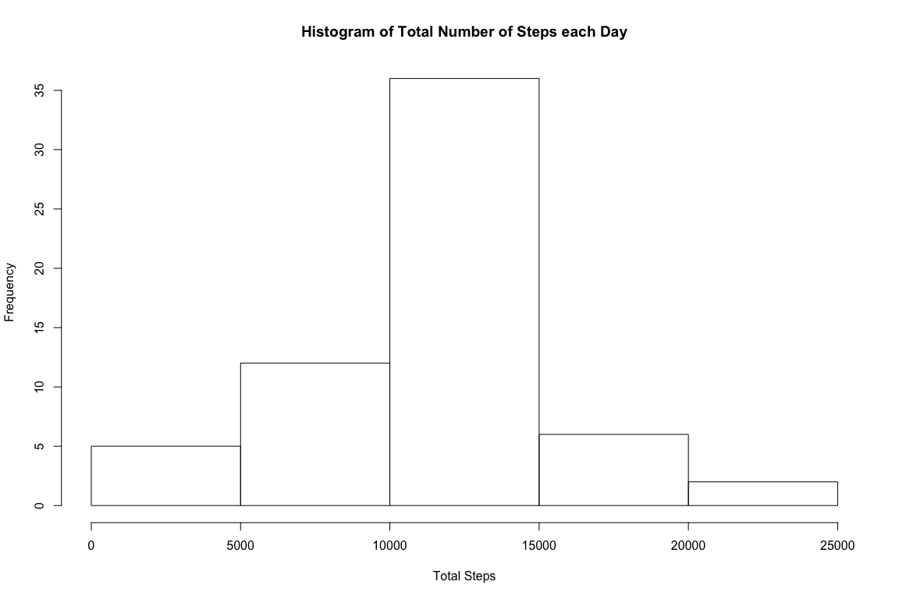

# Reproducible Research: Peer Assessment 1
Edwin Seah  
04 March 2015  


## Loading and preprocessing the data  
Unzip into a data directroy and read in the file containing activity data.
Loading is done using integer for *interval* to make simplify sorting later.

```r
unzip("activity.zip", exdir="data")
df <- read.csv("data/activity.csv", 
               header=TRUE, 
               colClasses=c("integer", "Date", "integer")
               )
```

## What is mean total number of steps taken per day?  

1. We'll make a histogram using a subset that will exclude the NA values. 
This subset named **mts** comprises 2 columns (*date* and *totalSteps*) 
and is made using `dplyr`.
The *interval* and *steps* columns are removed so we can group by the *date*.
Plotting the histogram using `breaks=10` allows for a reasonable number
of 10 bins in the histogram, such that we can better observe the distribution.  


```r
library(dplyr)
mts <- df[complete.cases(df),] %>% 
    group_by(date) %>% 
    mutate(totalSteps=sum(steps), interval=NULL, steps=NULL) %>%
    unique()

hist(mts$totalSteps, 
     breaks=10, 
     xlim=c(0,25000), 
     ylim=c(0,20),
     xlab="Total Steps", 
     main="Histogram of Total Number of Steps each Day")
```

 

2. Using the newly-created subset **mts**, the mean is 1.0766189\times 10^{4} 
and the median is `median(mts$totalSteps)` for the total number of steps.  


```r
mean(mts$totalSteps)
```

```
## [1] 10766.19
```

```r
median(mts$totalSteps)
```

```
## [1] 10765
```

## What is the average daily activity pattern?

1. Make a time series plot (i.e. type = "l") of the 5-minute interval (x-axis) 
and the average number of steps taken, averaged across all days (y-axis)


```r
library(dplyr)
avgDaily <- df[complete.cases(df),] %>% 
    group_by(interval) %>% 
    summarise_each(funs(mean), steps)

plot(avgDaily$interval, avgDaily$steps, 
     type="l", xlim=c(0,2355),
     xlab="Interval",
     ylab="Average Number of Steps",
     main="Average Daily Activity Pattern")
```

 

2. We use `select` to find the 5-minute interval containing the maximum number 
of steps on average across all the days in the dataset.  


```r
max(select(avgDaily, steps))
```

```
## [1] 206.1698
```

## Imputing missing values

1. Calculate and report the total number of missing values in the dataset (i.e. the total number of rows with NAs)  


```r
nrow(df[!complete.cases(df),])
```

```
## [1] 2304
```

2. Devise a strategy for filling in all of the missing values in the dataset. The strategy does not need to be sophisticated. For example, you could use the mean/median for that day, or the mean for that 5-minute interval, etc.  


```r
# count all non-complete
24*60/5
```

```
## [1] 288
```

```r
t <- df[!complete.cases(df),]
nrow(t)
```

```
## [1] 2304
```

```r
length(unique(t$date))
```

```
## [1] 8
```

```r
avgDaily[avgDaily$interval==5,]$steps
```

```
## [1] 0.3396226
```

3. Create a new dataset that is equal to the original dataset but with the missing data filled in.  


```r
# Using mean for each 5-minute interval to fill in missing values
filled <- df %>% mutate(steps=(ifelse(is.na(steps), avgDaily$steps, steps)))
```

4. Make a histogram of the total number of steps taken each day and Calculate and report the mean and median total number of steps taken per day. Do these values differ from the estimates from the first part of the assignment? What is the impact of imputing missing data on the estimates of the total daily number of steps?


```r
mtsImputed <- filled %>% 
    group_by(date) %>% 
    mutate(totalSteps=sum(steps), interval=NULL, steps=NULL) %>%
    unique()

hist(mtsImputed$totalSteps, 
     breaks=20, 
     xlim=c(0,25000), 
     ylim=c(0,20),
     xlab="Total Steps", 
     main="Histogram of Total Number of Steps each Day")
```

 

```r
mean(mtsImputed$totalSteps)
```

```
## [1] 10766.19
```

```r
median(mtsImputed$totalSteps)
```

```
## [1] 10766.19
```

```r
print(paste("Estimated Mean:", mean(mts$totalSteps)))
```

```
## [1] "Estimated Mean: 10766.1886792453"
```

```r
print(paste("Estimated Median:", median(mts$totalSteps)))
```

```
## [1] "Estimated Median: 10765"
```

```r
print(paste("Imputed Mean:", mean(mtsImputed$totalSteps)))
```

```
## [1] "Imputed Mean: 10766.1886792453"
```

```r
print(paste("Imputed Median:", median(mtsImputed$totalSteps)))
```

```
## [1] "Imputed Median: 10766.1886792453"
```

Imputation of the missing values does not change the mean from its estimate, but
does raise the median to match the mean.  

## Are there differences in activity patterns between weekdays and weekends?  

Create a new factor variable in the dataset with two levels -- "weekday" and "weekend" indicating whether a given date is a weekday or weekend day.  


```r
filled <- 
    filled %>% 
    mutate (weekday = as.factor(
        ifelse (weekdays(date)!="Saturday" || weekdays(date)!="Sunday", 
                "weekday", 
                "weekend")))
```

Make a panel plot containing a time series plot (i.e. type = "l") of the 5-minute interval (x-axis) and the average number of steps taken, averaged across all weekday days or weekend days (y-axis). The plot should look something like the following, which was created using simulated data:

